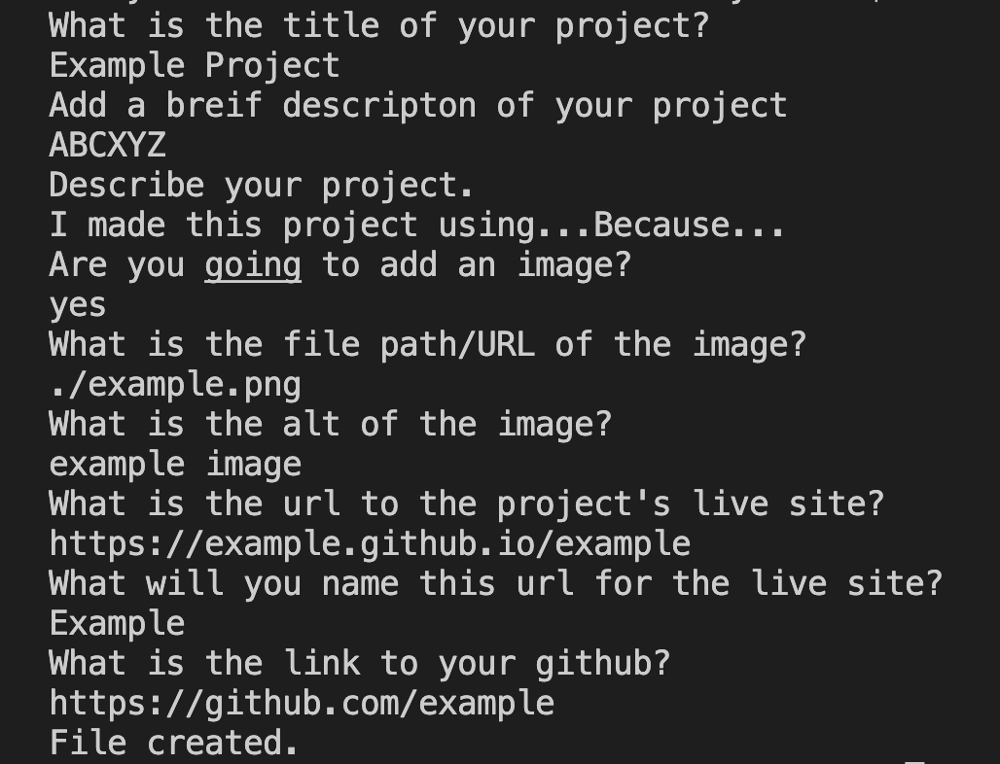

# README Generator

## Create a README file for your next coding project with ease!

I created this command line application to better understand node and markdown.

To use this application, clone or download the code to your computer, open a terminal to this application's folder and run the command `node READMEgenerator`

Check out more of my GitHub repositories [here](https://github.com/rileygcastle)
